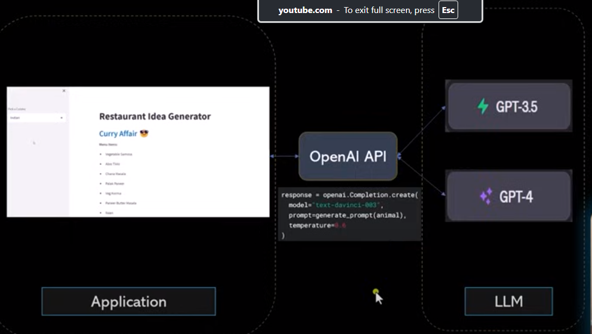
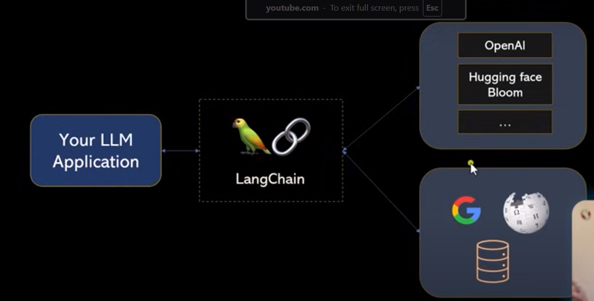

# AI evolution 
1. Statistical ML uses different factors (aka features) present in data. (House price prediction).

2. Neural Network (or Deep learning) came in for unstructured data. (Image classification)

3. Recurrent Neural Network solves the problem like langauge translation.

4. Transformer (LLM which is self supervised model)solves Prediction for autocomplete in email. For example. gpt (generative predictive transformer).





##  Installation for HuggingFace Models
```
pip install langchain
pip install langchain-huggingface
pip install huggingface_hub
pip install transformers
pip install accelerate
pip install bitsandbytes
```


